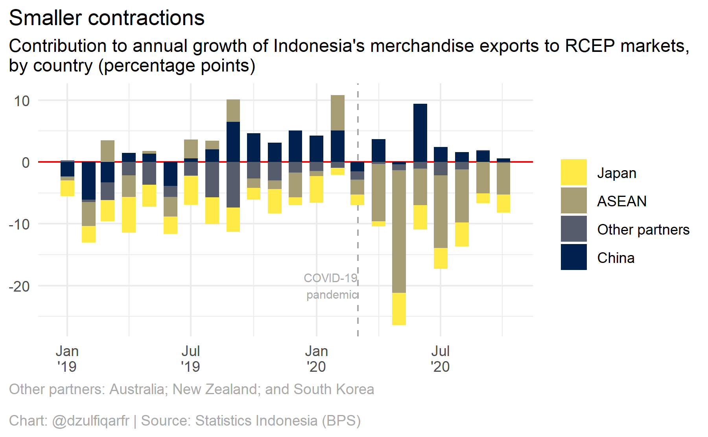

Indonesia’s exports to RCEP countries
================
2021-06-20

This is a documentation of how I analyzed the annual growth of
Indonesia’s merchandise exports to the Regional Comprehensive Economic
Partnership (RCEP) markets and calculated the contribution of exports to
each market to the growth.

This analysis was prepared for
<a href="https://www.thejakartapost.com/news/2020/12/22/yearender-signed-sealed-delivered-rcep-concluded-in-turbulent-year-for-global-trade.html" target="_blank">this article</a>.

## Packages

Load the packages.

``` r
library(tidyverse)
library(lubridate)
library(fs)
library(viridis)
```

## Data

I have already downloaded the data from
<a href="https://bps.go.id/exim" target="_blank">Statistics Indonesia (BPS)</a>.
(Too bad the agency’s application programming interface (API) did not
offer access to the export and import data page. Downloading the data
manually was labor-intensive, time-consuming and prone to error.)

``` r
# directory 
paths <- "data"
files <- fs::dir_ls(paths)

# function to tidy the data
tidy_this <- function(x, year) {
  
  x2 <- x %>% 
    dplyr::filter(!is.na(`[01] Januari`), X1 != "Totals") %>% 
    select(-c(2, ncol(x))) %>% 
    rename(countries = 1)
  
  col_names <- seq(
    ymd(str_c(year, "-01-01")), 
    ymd(str_c(year, "-12-01")), 
    by = "month"
  )
  
  names(x2)[2:ncol(x2)] <- as.character(col_names)
  
  return(x2)
  
}

# function to read and tidy the data
read_tidy_this <- function(x, y) {
  
  raw <- read_csv(x, na = "", skip = 1)
  
  tidy <- tidy_this(raw, year = y)
  
  return(tidy)
  
}


# read and tidy data
rcep_raw <- map_df(
  files[1:23],
  function(x) {
    
    yr <- if (str_detect(x, "2018")) {
      "2018"
    } else if (str_detect(x, "2019")) {
      "2019"
    } else {
      "2020"
    }
    
    read_tidy_this(x, yr)
    
  }
)
#> Warning: Missing column names filled in: 'X1' [1], 'X15' [15]

#> Warning: Missing column names filled in: 'X1' [1], 'X15' [15]

#> Warning: Missing column names filled in: 'X1' [1], 'X15' [15]

#> Warning: Missing column names filled in: 'X1' [1], 'X15' [15]
#> Warning: Missing column names filled in: 'X1' [1], 'X13' [13]
#> Warning in names(x2)[2:ncol(x2)] <- as.character(col_names): number of items to
#> replace is not a multiple of replacement length
#> Warning: Missing column names filled in: 'X1' [1], 'X15' [15]

#> Warning: Missing column names filled in: 'X1' [1], 'X15' [15]

#> Warning: Missing column names filled in: 'X1' [1], 'X15' [15]

#> Warning: Missing column names filled in: 'X1' [1], 'X15' [15]

#> Warning: Missing column names filled in: 'X1' [1], 'X15' [15]

#> Warning: Missing column names filled in: 'X1' [1], 'X15' [15]
#> Warning: Missing column names filled in: 'X1' [1], 'X13' [13]
#> Warning in names(x2)[2:ncol(x2)] <- as.character(col_names): number of items to
#> replace is not a multiple of replacement length
#> Warning: Missing column names filled in: 'X1' [1], 'X15' [15]

#> Warning: Missing column names filled in: 'X1' [1], 'X15' [15]
#> Warning: Missing column names filled in: 'X1' [1], 'X13' [13]
#> Warning in names(x2)[2:ncol(x2)] <- as.character(col_names): number of items to
#> replace is not a multiple of replacement length
#> Warning: Missing column names filled in: 'X1' [1], 'X15' [15]

#> Warning: Missing column names filled in: 'X1' [1], 'X15' [15]
#> Warning: Missing column names filled in: 'X1' [1], 'X13' [13]
#> Warning in names(x2)[2:ncol(x2)] <- as.character(col_names): number of items to
#> replace is not a multiple of replacement length
#> Warning: Missing column names filled in: 'X1' [1], 'X15' [15]

#> Warning: Missing column names filled in: 'X1' [1], 'X15' [15]

#> Warning: Missing column names filled in: 'X1' [1], 'X15' [15]

#> Warning: Missing column names filled in: 'X1' [1], 'X15' [15]
#> Warning: Missing column names filled in: 'X1' [1], 'X13' [13]
#> Warning in names(x2)[2:ncol(x2)] <- as.character(col_names): number of items to
#> replace is not a multiple of replacement length


# tidy

## reshape and remove duplicates with missing values
rcep_raw_res <- rcep_raw %>% 
  pivot_longer(
    2:ncol(.), 
    names_to = "date", 
    values_to = "export_value_usd"
  ) %>% 
  dplyr::filter(!is.na(export_value_usd)) %>% 
  arrange(countries, date)

## convert country names to title case, replace some country names
rcep_tidy <- rcep_raw_res %>% 
  mutate(
    countries = str_to_title(countries),
    countries = str_replace_all(
      countries,
      c(
        "Korea, Republic Of" = "South Korea",
        "Lao Peoples Dem. Rep." = "Laos",
        "Viet Nam" = "Vietnam"
      )
    ),
    date = ymd(date)
  )

# glimpse
glimpse(rcep_tidy)
#> Rows: 476
#> Columns: 3
#> $ countries        <chr> "Australia", "Australia", "Australia", "Australia", "~
#> $ date             <date> 2018-01-01, 2018-02-01, 2018-03-01, 2018-04-01, 2018~
#> $ export_value_usd <dbl> 209083105, 180308451, 295879676, 218095679, 283234557~
```

Calculate the sum of export values by groups, namely the Association of
Southeast Asian Nations (ASEAN) and Australia, New Zealand and South
Korea under “other” group.

``` r
# asean countries
asean <- c(
  "Singapore",
  "Thailand",
  "Philippines",
  "Vietnam",
  "Laos",
  "Myanmar",
  "Cambodia",
  "Malaysia",
  "Brunei Darussalam"
)

# sum export values to asean countries
asean_exp <- rcep_tidy %>% 
  dplyr::filter(countries %in% asean) %>% 
  group_by(date) %>% 
  mutate(
    countries = "ASEAN",
    export_value_usd = sum(export_value_usd)
  ) %>% 
  ungroup() %>% 
  distinct(date, .keep_all = T)

# sum export values to australia, south korea, new zealand
other_exp <- rcep_tidy %>% 
  dplyr::filter(countries %in% c("Australia", "South Korea", "New Zealand")) %>% 
  group_by(date) %>% 
  mutate(
    countries = "Other partners",
    export_value_usd = sum(export_value_usd)
  ) %>% 
  ungroup() %>% 
  distinct(date, .keep_all = T)

# join all data
rcep_grouped <- rcep_tidy %>% 
  dplyr::filter(countries %in% c("China", "Japan")) %>% 
  rbind(asean_exp, other_exp) %>% 
  arrange(countries)

# glimpse
glimpse(rcep_grouped)
#> Rows: 136
#> Columns: 3
#> $ countries        <chr> "ASEAN", "ASEAN", "ASEAN", "ASEAN", "ASEAN", "ASEAN",~
#> $ date             <date> 2018-01-01, 2018-02-01, 2018-03-01, 2018-04-01, 2018~
#> $ export_value_usd <dbl> 3282496320, 3541414171, 3302619520, 3440241303, 36746~
```

Calculate total exports to RCEP countries.

``` r
rcep_grouped_total <- rcep_grouped %>% 
  group_by(date) %>% 
  mutate(total_exp_val_usd = sum(export_value_usd)) %>% 
  ungroup()

# glimpse
glimpse(rcep_grouped_total)
#> Rows: 136
#> Columns: 4
#> $ countries         <chr> "ASEAN", "ASEAN", "ASEAN", "ASEAN", "ASEAN", "ASEAN"~
#> $ date              <date> 2018-01-01, 2018-02-01, 2018-03-01, 2018-04-01, 201~
#> $ export_value_usd  <dbl> 3282496320, 3541414171, 3302619520, 3440241303, 3674~
#> $ total_exp_val_usd <dbl> 8073756408, 8154247173, 8613304590, 8109152891, 8786~
```

Calculate the contribution to export growth to RCEP markets as a whole.

``` r
rcep_ctg <- rcep_grouped_total %>% 
  group_by(countries) %>% 
  mutate(
    diff = export_value_usd - dplyr::lag(export_value_usd, 12),
    pct_chg_yoy = diff / dplyr::lag(export_value_usd, 12) * 100,
    prop = export_value_usd / total_exp_val_usd * 100,
    ctg = pct_chg_yoy * dplyr::lag(prop, 12) / 100
  ) %>% 
  ungroup()

# glimpse
glimpse(rcep_ctg)
#> Rows: 136
#> Columns: 8
#> $ countries         <chr> "ASEAN", "ASEAN", "ASEAN", "ASEAN", "ASEAN", "ASEAN"~
#> $ date              <date> 2018-01-01, 2018-02-01, 2018-03-01, 2018-04-01, 201~
#> $ export_value_usd  <dbl> 3282496320, 3541414171, 3302619520, 3440241303, 3674~
#> $ total_exp_val_usd <dbl> 8073756408, 8154247173, 8613304590, 8109152891, 8786~
#> $ diff              <dbl> NA, NA, NA, NA, NA, NA, NA, NA, NA, NA, NA, NA, -490~
#> $ pct_chg_yoy       <dbl> NA, NA, NA, NA, NA, NA, NA, NA, NA, NA, NA, NA, -1.4~
#> $ prop              <dbl> 40.65637, 43.43030, 38.34323, 42.42418, 41.82286, 40~
#> $ ctg               <dbl> NA, NA, NA, NA, NA, NA, NA, NA, NA, NA, NA, NA, -0.6~
```

## Plot

Plot the data to see how exports to each member country contributes to
the annual export growth to RCEP markets as a whole.

``` r
rcep_ctg %>% 
  dplyr::filter(!is.na(ctg)) %>% 
  mutate(countries = fct_reorder(countries, ctg)) %>% 
  ggplot(aes(date, ctg, fill = countries)) +
  geom_hline(yintercept = 0, color = "red") +
  geom_vline(
    xintercept = ymd("2020-03-02"), 
    color = "darkgrey", 
    lty = "dashed"
  ) +
  geom_col(width = 20, position = "stack") +
  scale_x_date(date_labels = "%b\n'%y") +
  scale_fill_viridis_d(option = "cividis", direction = -1) +
  labs(
    title = "Smaller contractions",
    subtitle = "Contribution to annual growth of Indonesia's merchandise exports to RCEP markets,\nby country (percentage points)",
    caption = "Other partners: Australia; New Zealand; and South Korea\n\nChart: @dzulfiqarfr | Source: Statistics Indonesia (BPS)"
  ) +
  annotate(
    "text",
    x = ymd("2020-03-01"),
    y = -20,
    label = "COVID-19\npandemic",
    size = 2.5,
    color = "darkgrey",
    hjust = 1
  ) +
  theme_minimal() +
  theme(
    axis.title = element_blank(),
    legend.title = element_blank(),
    plot.title.position = "plot",
    plot.caption = element_text(color = "darkgrey", hjust = 0),
    plot.caption.position = "plot"
  )
```



For the article, I did not use **ggplot2** to visualize the data.
Instead, I use [Datawrapper](https://datawrapper.de).
